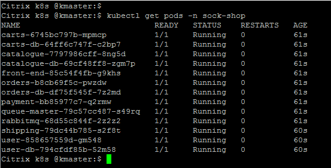
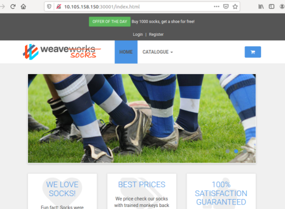

# Learn how to deploy Sock-Shop microservice application in Citrix Cloud Native Stack on Kubernetes on-prem cluster (Tier 1 ADC as Citrix ADC VPX, Tier 2 ADC as Citrix ADC CPX)

In this guide you will learn:
* What is service mesh lite deployment?
* How to deploy sock shop microservice applications without Citrix ADC
* How to insert Citrix ADC (VPX) in sock shop microservice applications for North South Load balancing
* How to insert Citrix ADC (CPX) in sock shop microservice applications for East-West Load balancing
* Expose CPXs using LoadBalancer service for simplified solution 
* Troubleshoot microservices using ADM service Graph
* Send SRE observability time-series metrics to Prometheus end point using Citrix Observability Exporter

## Pre-requisite before you start microservice deployment

1.	Bring your own nodes (BYON)

    Kubernetes is an open-source system for automating deployment, scaling, and management of containerized applications. Please install and configure Kubernetes cluster with one master node and at least two worker node deployment.
    Recommended OS: Ubuntu 16.04 desktop/server OS. 
    Visit: https://kubernetes.io/docs/setup/ for Kubernetes cluster deployment guide.
    Once Kubernetes cluster is up and running, execute the below command on master node to get the node status.
    ``` 
    kubectl get nodes
    ```
    
 
    (The following example is tested in on-prem Kubernetes cluster version 1.17.0).

2.	<u>[Optional]</u> Set up a Kubernetes dashboard for deploying containerized applications.
    
    Please visit https://kubernetes.io/docs/tasks/access-application-cluster/web-ui-dashboard/ and follow the steps mentioned to bring the Kubernetes dashboard up as shown below.

    

3. Add K8s CIDR routes to Tier 1 ADC to reach K8s network

    Make sure that route configuration is present in Tier 1 ADC so that Ingress NetScaler should be able to reach Kubernetes pod network for seamless connectivity. Please refer to https://github.com/citrix/citrix-k8s-ingress-controller/blob/master/docs/network/staticrouting.md#manually-configure-route-on-the-citrix-adc-instance for Network configuration.
    If you have K8s cluster and Tier 1 Citrix ADC in same subnet then you do not have to do anything, below example will take care of route info.
    You need Citrix Node Controller configuration only when K8s cluster and Tier 1 ADC are in different subnet. Please refer to https://github.com/citrix/citrix-k8s-node-controller for Network configuration.


| Section | Description |
| ------- | ----------- |
| [Section A]() | Deploy Sock-shop microservice application without Citrix ADC |
| [Section B]() | Deploy Sock-shop microservice application using Citrix ADC |
| [Section C]() | Troubleshoot Sock-shop microservices using ADM service graph |
| [Section D]() | Troubleshoot Sock-shop microservices using Citrix Observability Exporter |

## Section A (Deploy Sock-shop microservice application without Citrix ADC)

Sock Shop is open source, (Apache License, Version 2.0) and is free to use for deployments. For more information refer to [Sock Shop-A Microservices Demo Application](https://microservices-demo.github.io/)
```
kubectl create namespace sock-shop
kubectl create -f https://raw.githubusercontent.com/citrix/cloud-native-getting-started/master/on-prem/ServiceMeshLite/sock-shop/manifest/sock-shop.yaml -n sock-shop
```


Lets see the status of sock-shop application deployment
```
kubectl get pods -n sock-shop
```

```
kubectl get svc -n sock-shop
```


Access Sock-Shop application exposed on NodePort by default.
```
http:// <K8s-Master-Node-Ip> : 30001
```



## Section B (Deploy Sock-shop microservice application using Citrix ADC)

We will use Service mesh lite deployment to demonstrate Sock shop microservice application.
We have created automation script to generate yamls files for deploying sock shop application in Service Mesh lite topology.
You can refer to [SML generator tool](https://github.com/citrix/citrix-k8s-ingress-controller/blob/master/docs/deploy/service-mesh-lite.md#create-service-mesh-lite-yamls) for generating yamls file.

**Note:** SML yaml generator script insert CPX exposed as Ingress type service. However in this example I will modify yamls generated from tool to expose CPX using LoadBalancer type service.

Lets deploy the sock shop application in Service mesh lite deployment where
* Tier 1 ADC - VPX to ingress Secure North-South traffic. You can have MPX/BLX as TIer 1 ADC also.
* Tier 2 ADC - CPX to route North-South traffic from Tier 1 ADC to frontend sock-shop microservice application
* Tier 2 ADC - Two CPXs to route East-West traffic from sock-shop microservices

**Topology:**

##### Use Case 1: Secure the sock-shop application traffic using Citrix ADC (Access application over SSL)

1. Lets deploy the sock-shop application with Citrix ADC to secure microservices from Internet.

```
wget  https://raw.githubusercontent.com/citrix/cloud-native-getting-started/master/on-prem/ServiceMeshLite/sock-shop/manifest/sock-shop-with-cpx.yaml
wget  https://raw.githubusercontent.com/citrix/cloud-native-getting-started/master/on-prem/ServiceMeshLite/sock-shop/manifest/sock-shop-tier1-cic.yaml
wget  https://raw.githubusercontent.com/citrix/cloud-native-getting-started/master/on-prem/ServiceMeshLite/sock-shop/manifest/vip.yaml
wget  https://raw.githubusercontent.com/citrix/cloud-native-getting-started/master/on-prem/ServiceMeshLite/sock-shop/manifest/ipam_deploy.yaml
wget  https://raw.githubusercontent.com/citrix/cloud-native-getting-started/master/on-prem/ServiceMeshLite/sock-shop/manifest/sockshop-secret.yaml
```

Update ``sock-shop-with-cpx.yaml`` yaml file with following values:

To view Service Graph update following parameter in <u>cpx-ingress1, cpx-ingress2, cpx-ingress3 deployment kind</u>

**Note:** You can comment or delete below Environment variables from yaml file if do not want explore ADM service graph
i. NS_MGMT_SERVER -> With ADM agent IP or ADM onprem IP
ii. "NS_MGMT_FINGER_PRINT" -> ADM agent fingerprint or ADM onprem fingerprint
iii. "LOGSTREAM_COLLECTOR_IP" -> With ADM agent IP or ADM onprem IP
iv. "NS_LOGPROXY" -> With ADM agent IP or ADM onprem IP

Refer to [How to setup ADM Service Graph on ADM service](https://docs.citrix.com/en-us/citrix-application-delivery-management-service/application-analytics-and-management/service-graph-begin.html)

Refer to [How to setup ADM Service Graph on ADM onprem](https://docs.citrix.com/en-us/citrix-application-delivery-management-software/13/application-analytics-and-management/service-graph-begin.html)

You can directly pass the user name and password as environment variables to the Citrix ingress controller or use K8s secrets (recommended). If you want to use K8s secrets, create a secret for the user name and password using the following command:
```
kubectl create secret generic nslogin --from-literal=username='nsroot' --from-literal=password='nsroot'
```
**Note:** ``nslogin`` secret is used in Citrix Ingress Controller CPX sidecar container to login into CPX where you do not have to change any password. 

```
kubectl create secret generic vpxlogin --from-literal=username='VPXUserName' --from-literal=password='VPXPassword'
```
**Note:** ``vpxlogin`` secret is used for login into VPX (Tier 1 ADC), you have to update Tier 1 ADC login credentials.

Lets deploy sock-shop application with Citrix ADC in place
```
kubectl create -f sock-shop-with-cpx.yaml
```

2. Lets deploy SSL certificate to secure North-South traffic

```
kubectl create -f sockshop-secret.yaml
```

3. Expose sock-shop application to Internet using External-IP

Citrix Cloud Native stack has internal IP management logic to assign external-IP address for services exposed via LoadBalancer type service called as IPAM solution.
We have created IPAM deployment using k8s native CRD infrastructure. Lets deploy CRD and provide IP range to external-IP selection.

Update ``ipam_deploy.yaml`` yaml file with free IP list:
```        
- name: "VIP_RANGE"
  value: '["10.105.158.196-10.105.158.199"]'
```
Update VIP_RANGE values with free IP that will be used as front end IP (VIP) in Tier 1 ADC

```
kubectl create -f vip.yaml
kubectl create -f ipam_deploy.yaml
```

4. Deploy Citrix Ingress Controller to configure Tier 1 ADC automatically.

Update ``sock-shop-tier1-cic.yaml`` yaml file with below values:
```
- name: "NS_IP"
  value: "10.105.158.148"
```
Change the NS_IP value to Tier 1 ADC of your deployment.

```
kubectl create -f sock-shop-tier1-cic.yaml
```

5. Your sock-shop application is ready to securely accessed via Citrix ADC

Login to Tier 1 ADC and verify that sock-shop application configuration correctly.

Add the DNS entries in your local machine host files for accessing microservices though Internet

Path for host file:[Windows] ``C:\Windows\System32\drivers\etc\hosts`` [Macbook] ``/etc/hosts``
Add below entries in hosts file and save the file
```
< External-IP from CPX service> citrix.weavesocks
```
You can check External-IP for your cpx-ingress1 using below command:
```
kubectl get svc
```

##### Use Case 2: Secure the sock-shop application traffic using Citrix ADC (Access application over SSL)


## Section C (Troubleshoot Sock-shop microservices using ADM service graph)

## Section D (Troubleshoot Sock-shop microservices using Citrix Observability Exporter)