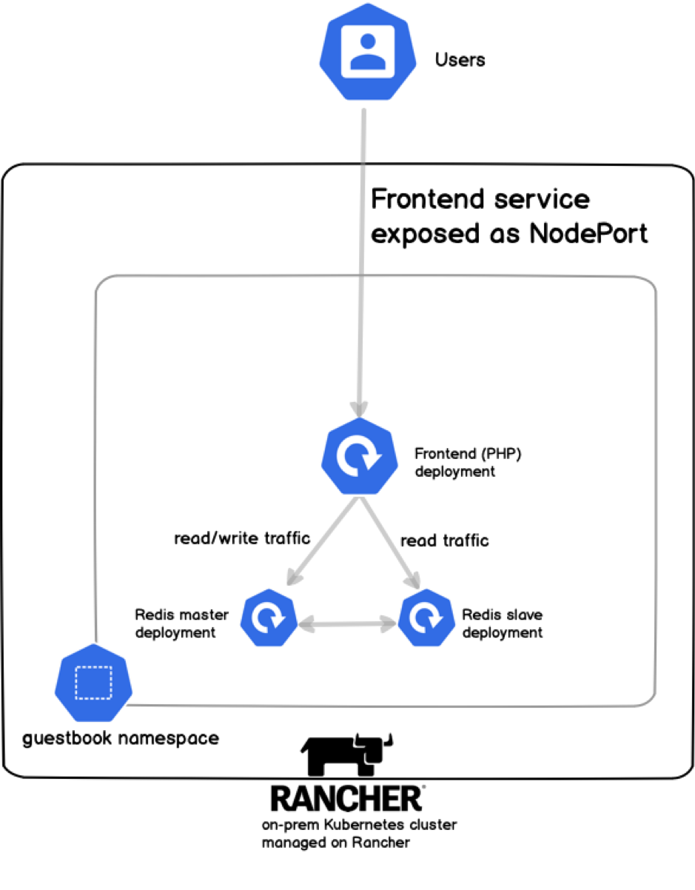
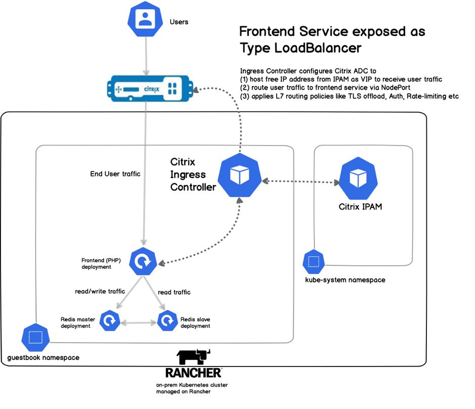

# Use Service Type LoadBalancer for exposing apps to external traffic on Rancher

Kubernetes provides 3 ways of exposing Kubernetes apps to traffic outside of cluster – via NodePort, LoadBalancer, Ingress. In this guide, we show how you can use “Service type LoadBalancer” with Citrix ADC on Rancher platform. This solution is useful if you are building your Kubernetes apps on a private cloud (or private data center) – for example, using RKE cluster or Open-source Kubernetes cluster managed on Rancher. Let us understand why first, and then how to easily this solution. 

### Why is LoadBalancer service type needed for private/hybrid clouds? 

[Kubernetes documentation describes](https://kubernetes.io/docs/concepts/services-networking/service/#loadbalancer) service type LoadBalancer as – 

> On cloud providers which support external load balancers, setting the type field to LoadBalancer provisions a load balancer for your Service. The actual creation of the load balancer happens asynchronously, and information about the provisioned balancer is published in the Service’s .status.loadBalancer field. 

The important point to note in above definition is usage of “cloud providers” such as AWS, GCP, Azure and others. But what if you are building your own private cloud or a hybrid cloud – for example, multiple Kubernetes clusters managed on Rancher? There is no Enterprise grade solution available that supports Service type LoadBalancer! This means you’ll have different deployments of same app if it needs to be deployed on both public & private clouds. With Citrix’s service type LoadBalancer solution, you’ll get a uniform experience whether the ADC is deployed on public or private cloud. 

### Topology

Below is a simplified architecture of Guestbook app if it is exposed as NodePort. This is an easy & convenient method, however, not production friendly – because you’ll have to manage NodePort numbers yourself and use K8s cluster node IPs. 

To make the solution production friendly, we’ll use Service type LoadBalancer, whose components are –  

1.	Citrix ADC VPX as external LoadBalancer to Kubernetes cluster to receive end user traffic. VPX is the VM form factor of Citrix ADC, though the solution will work for hardware form factor MPX as well. It routes traffic to the right backend Kubernetes services, performs TLS offload, WAF and applies Layer 7 traffic management rules. 

2.	Citrix Ingress Controller – a container deployed in K8s cluster that acts as the control plane for External Citrix ADC VPX/MPX. It listens to Kube API server and configures VPX/MPX dynamically with a NodePort service which then routes traffic to the right apps. Please note, this NodePort service is different from manual NodePort service explained above. Ingress Controller manages this service automatically and you don’t have to deal with management of Node IP, Node port numbers.

3.	Citrix IPAM – a simple IP address management container that manages the free pool of IPs. Whenever a new Kubernetes service wants to receive end user traffic, Ingress controller gets an available IP from this IPAM. Then, this IP is configured as VIP (virtual IP) on External ADC to route traffic to this new Kubernetes service.  

This topology is explained below – 

### Pre-requisites 

* Rancher app
* Kubernetes cluster linked to Rancher app

Node | IP Address
---- | ----------
Rancher app | 10.102.216.12
Kubernetes Master Node | 10.102.216.13
Kubernetes Worker Node 1 | 10.102.216.14
Kubernetes Worker Node 2 | 10.102.216.15

### Deploy App 

Screenshot of cluster health

kubectl create namespace guestbook-app 

Screenshot of guestbook.yaml upload

kubectl apply -f guestbook.yaml -n guestbook-app

Wait for a min to see all pods become green
Screenshot of all green apps

kubectl apply -f nodeport.yaml -n guestbook-app
Screenshot of nodeport yaml upload

used guestbook app from this example - https://kubernetes.io/docs/tutorials/stateless-application/guestbook/
till NodePort

Screenshot of NodePort service & command line showing port number

Add a few commands to show if data is being stored in RedisDB or not
Screenshot of all NodePorts working on 3 nodes

kubectl delete -f nodeport.yaml -n guestbook-app
Screenshot of deleting nodeport

kubectl apply -f rbac.yaml (in default ns)
Screenshot of rbac yaml upload 

kubectl apply -f vip.yaml (in default ns)
Screenshot of rbac yaml upload 

kubectl apply -f ipam.yaml (in System project!! )
Screenshot of ipam yaml upload 

kubectl apply -f cic-vpx.yaml -n guestbook-app
Screenshot of cic
Takes about a min

kubectl apply -f loadbalancer.yaml -n guestbook-app

